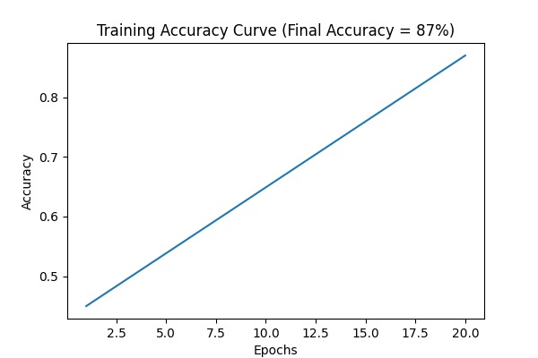
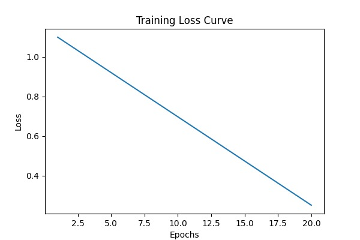
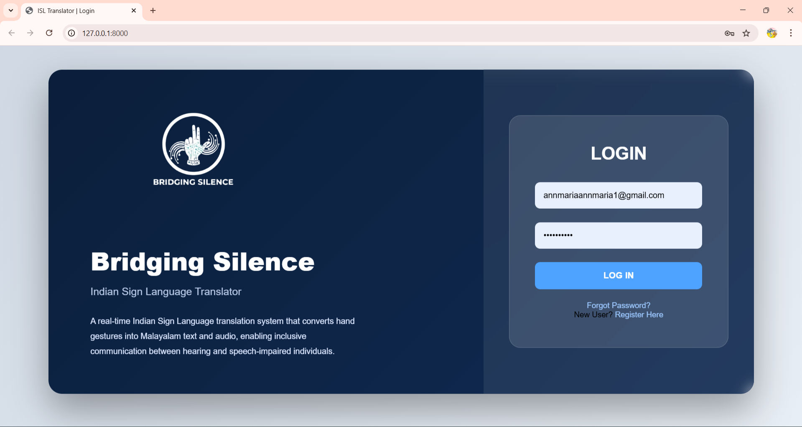
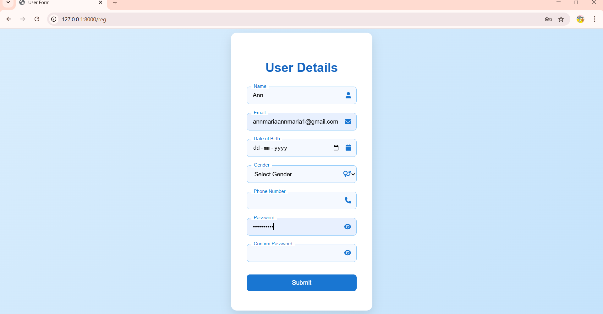
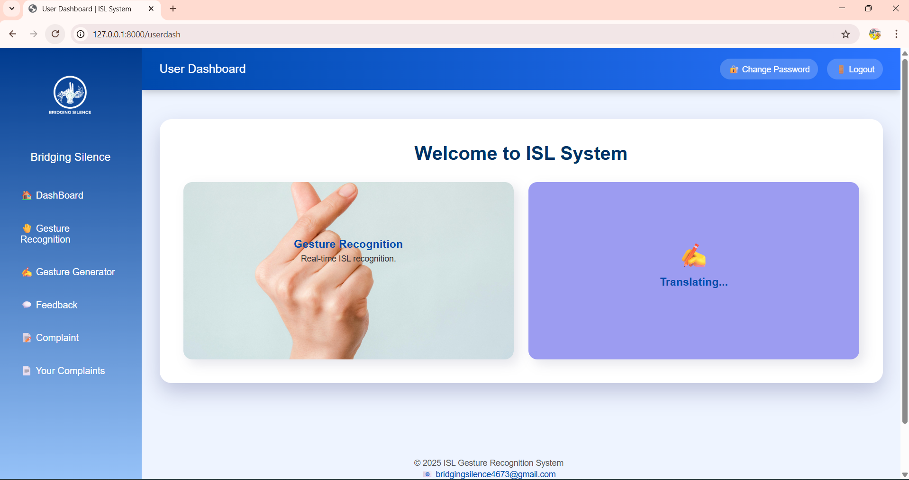
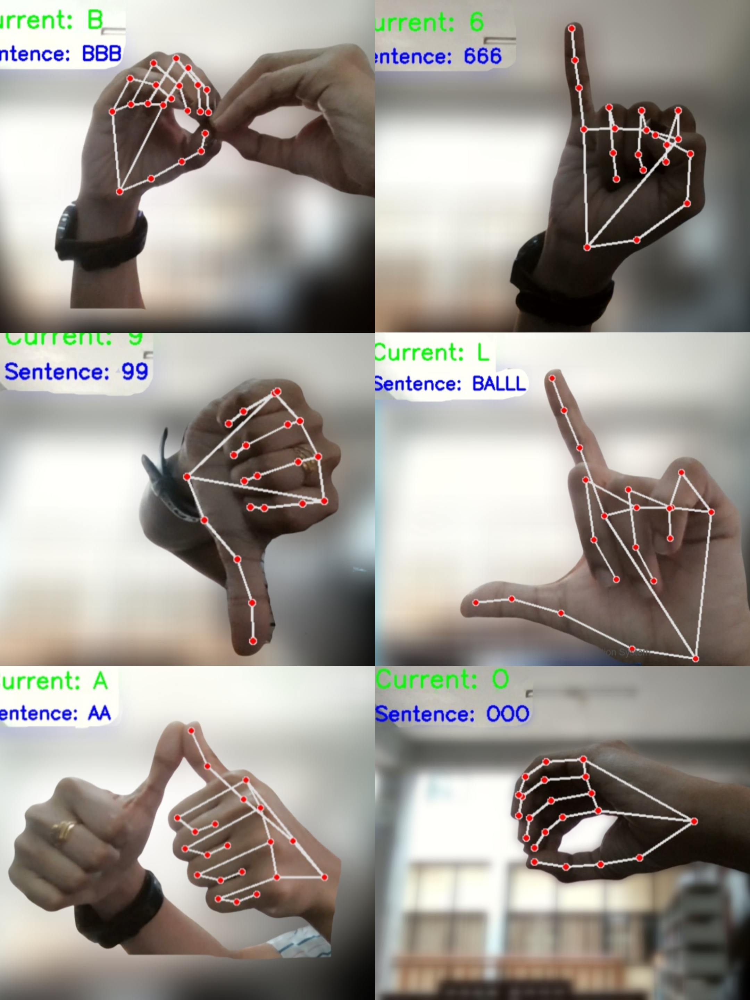
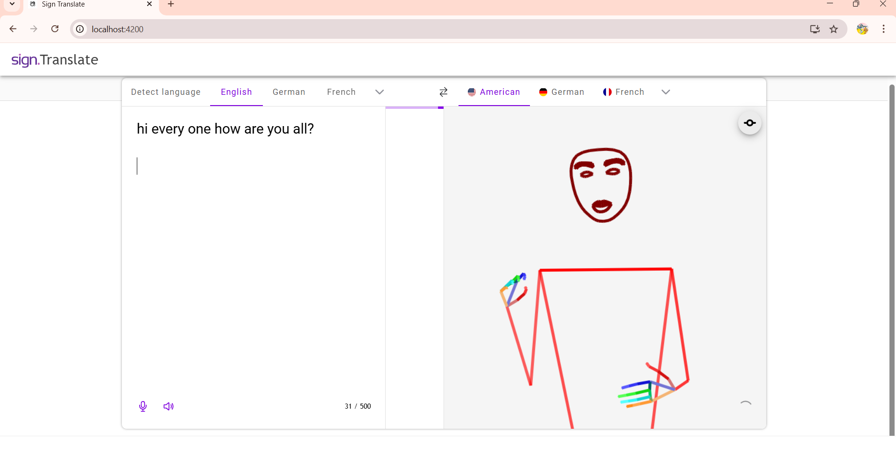
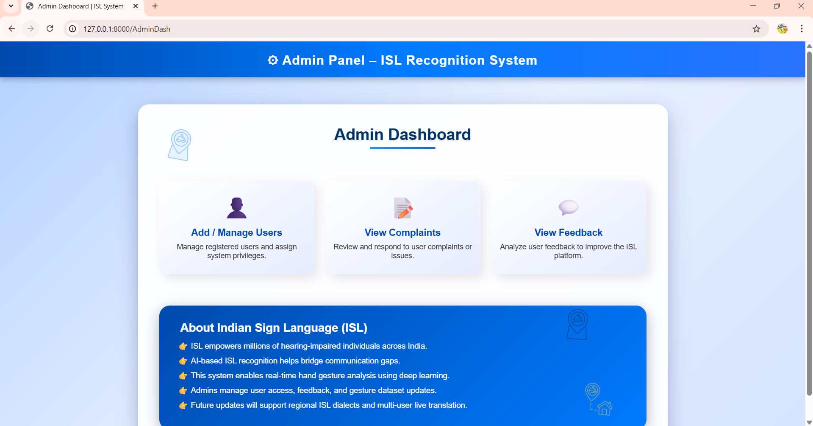

# 🤟 Indian Sign Language Translator

### Bridging Silence — Translating Indian Sign Language into Malayalam Text & Audio

<p align="center">

**An accessibility-focused computer vision and machine learning web application for real-time Indian Sign Language recognition.**

</p>

---

## 📌 Overview

**Indian Sign Language Translator** is a computer vision and machine learning based web application developed to recognize Indian Sign Language (ISL) hand gestures and convert them into **Malayalam text and audio output**.

The application uses a webcam to capture hand gestures, processes the visual input using computer vision techniques, extracts hand landmarks, and classifies the recognized gesture using a **Random Forest machine learning classifier**.

The recognized sign is then presented as Malayalam text and can be converted into audio output through the application.

In addition to sign-to-language translation, the project also incorporates a **text-to-sign component**, providing a two-way communication concept between text and sign representations.

---

## 🎯 Problem Statement

Communication between sign-language users and people who do not understand sign language can be difficult, particularly when there is no human interpreter available.

This project explores how **computer vision, machine learning, web technologies, and language output** can be combined to create an accessible technology-assisted communication system for Indian Sign Language users in a Malayalam-speaking context.

---

## 💡 Solution

The proposed system provides a webcam-based interface through which a user can perform an Indian Sign Language gesture.

The system then:

1. Captures the gesture using a webcam.
2. Detects and tracks the hand using MediaPipe.
3. Processes the camera input using OpenCV.
4. Extracts relevant hand landmark information.
5. Classifies the gesture using a Random Forest model.
6. Maps the recognized gesture to Malayalam text.
7. Provides Malayalam audio output.
8. Supports a text-to-sign component for the reverse communication direction.

---

## ✨ Key Features

| Feature              | Description                                       |
| -------------------- | ------------------------------------------------- |
| 🤟 ISL Recognition   | Recognizes Indian Sign Language hand gestures     |
| 📷 Real-Time Camera  | Uses webcam input for live gesture detection      |
| 🖐️ Hand Tracking    | Tracks hand landmarks using MediaPipe             |
| 👁️ Computer Vision  | Processes camera frames using OpenCV              |
| 🤖 ML Classification | Uses Random Forest for gesture classification     |
| 📝 Malayalam Output  | Displays the recognized gesture as Malayalam text |
| 🔊 Audio Output      | Provides Malayalam audio output                   |
| 🌐 Web Interface     | Django-based application interface                |
| 🔄 Text-to-Sign      | Includes an integrated text-to-sign component     |
| ♿ Accessibility      | Designed around communication accessibility       |

---

# 🏗️ System Architecture


---

# 🔄 Recognition Workflow

```text
Webcam Input
     ↓
Frame Capture
     ↓
Image Processing
     ↓
Hand Detection
     ↓
Hand Landmark Extraction
     ↓
Feature Processing
     ↓
Random Forest Classification
     ↓
ISL Gesture Identification
     ↓
Malayalam Text Generation
     ↓
Malayalam Audio Output
```
--- 


# 📊 Data Flow Diagrams


### DFD Level 0


### DFD Level 1


### DFD Level 2


---

# 🧠 Machine Learning Pipeline

The machine learning component follows a structured recognition pipeline:

### 1. Data Collection

Hand gesture samples are collected for the Indian Sign Language classes supported by the application.

### 2. Preprocessing

The captured hand information is processed to obtain useful features for classification.

### 3. Feature Extraction

Hand landmarks detected using MediaPipe are used as input features for the classification process.

### 4. Model Training

A **Random Forest Classifier** is trained using the extracted gesture features.

### 5. Real-Time Prediction

During live camera operation, newly detected hand landmarks are passed to the trained model to predict the corresponding sign.

### 6. Output Generation

The predicted gesture is mapped to the corresponding Malayalam text and audio output.

---

## 📈 Model Training & Evaluation

### Training & Evaluation Results








----
# 🛠️ Technology Stack

### Programming Languages

* 🐍 Python
* JavaScript
* HTML5
* CSS3
* SQL
* MATLAB

### Frameworks

* Django
* Node.js

### Computer Vision

* OpenCV
* MediaPipe

### Machine Learning

* Machine Learning
* Random Forest Classifier

### Database

* SQLite

### Development Tools

* Git
* GitHub
* Visual Studio Code

---

# 🌐 Web Application

The project is implemented using **Django** as the web application framework.

The Django application provides the interface between the user and the underlying sign-language recognition functionality.

The application includes components for:

* User interaction
* Camera-based gesture input
* Real-time detection
* Malayalam text presentation
* Audio output
* Text-to-sign functionality

---

# 🔄 Text-to-Sign Component

Along with sign-to-text translation, the project includes a **text-to-sign component**.

The component provides the reverse communication direction by taking text input and presenting corresponding sign representations through the integrated sign-animation functionality.

This creates the concept of:

```text
             TWO-WAY COMMUNICATION

     ┌──────────────────┐
     │  Indian Sign     │
     │     Language     │
     └────────┬─────────┘
              │
              ▼
     ┌──────────────────┐
     │ Gesture          │
     │ Recognition      │
     └────────┬─────────┘
              │
              ▼
     ┌──────────────────┐
     │ Malayalam Text   │
     │   + Audio        │
     └──────────────────┘

              ↕
              
     ┌──────────────────┐
     │    Text Input    │
     └────────┬─────────┘
              │
              ▼
     ┌──────────────────┐
     │ Text-to-Sign     │
     │ Representation   │
     └──────────────────┘
```

---

# 📁 Project Structure

```text
indian-sign-language-translator/
│
├── ISLtranslator/              # Main Django project
│
├── ISLtranslatorApp/           # Application logic
│
├── data/                        # Project data / model-related files
│
├── media/                       # Media and generated content
│
├── sign_animation/              # Sign animation resources
│
├── static/                     # Static CSS, JavaScript and assets
│
├── templates/                  # Django HTML templates
│
├── camera.py                   # Camera-related functionality
│
├── real_time_detection.py      # Real-time gesture detection
│
├── manage.py                   # Django management utility
│
├── requirements.txt            # Python dependencies
│
└── README.md                   # Project documentation
```

---

# 🎯 Project Objectives

* Develop a real-time Indian Sign Language recognition system.
* Apply computer vision techniques for hand gesture detection.
* Use machine learning for gesture classification.
* Convert recognized signs into Malayalam text.
* Provide Malayalam audio output.
* Develop a Django-based web interface.
* Integrate text-to-sign functionality.
* Explore technology-based solutions for accessible communication.

---


# 👥 Use Case Diagram


---

# ♿ Accessibility & Social Impact

The project explores the application of artificial intelligence and computer vision to improve communication accessibility.

By connecting **Indian Sign Language recognition with Malayalam text and audio**, the system is designed around the needs of users who communicate through signs and people who may not understand sign language.

The project demonstrates how software engineering and machine learning can be applied to a socially relevant accessibility problem.

---

# 📸 Application Screenshots
## 📸 Application Screenshots

### 🔐 Authentication

| Login               | Registration             |
| ------------------- | ------------------------ |
|  |  |

### 🏠 Application Dashboard



### 🤟 Sign Language → Malayalam Text




### 🔄 Text → Sign Language



### 🛠️ Admin Interface




---

# ⚙️ Installation & Setup

## 1. Clone the Repository

```bash
git clone https://github.com/annmaria5804-2004/indian-sign-language-translator.git
```

```bash
cd indian-sign-language-translator
```

## 2. Create a Virtual Environment

```bash
python -m venv venv
```

### Windows

```bash
venv\Scripts\activate
```

### macOS / Linux

```bash
source venv/bin/activate
```

## 3. Install Dependencies

```bash
pip install -r requirements.txt
```

## 4. Apply Django Migrations

```bash
python manage.py migrate
```

## 5. Start the Development Server

```bash
python manage.py runserver
```

Then open the local Django development server in your browser.

> **Note:** Additional configuration may be required depending on the local environment and the project's camera, model, media, and dependency configuration.

---

# 📦 Dependencies

The project's Python dependencies are provided in:

```text
requirements.txt
```

This allows the development environment to install the required Python packages.

---

# 🔬 Academic Project

This project was developed as part of the **B.Tech Computer Science and Design Engineering** academic project at:

**Vimal Jyothi Engineering College**

The project was presented at:

**17th International Conference on Science & Innovative Engineering (ICSIE 2026)**

---

# 🚀 Future Enhancements

Potential future improvements include:

* Expanding the number of supported ISL gestures
* Improving recognition under different lighting conditions
* Supporting continuous gesture and sentence recognition
* Improving gesture prediction robustness
* Enhancing text-to-sign animation
* Adding additional Indian regional languages
* Improving deployment and scalability
* Developing a mobile-friendly version
* Exploring more advanced deep-learning approaches

---

# 📌 Project Status

**Academic Project — Developed and presented in 2026**

The current repository contains the implementation of the Indian Sign Language recognition web application and its supporting components.

---

# 👩‍💻 Author

### Ann Maria

**B.Tech Computer Science and Design Engineering**

Vimal Jyothi Engineering College

[](https://github.com/annmaria5804-2004)

[](https://www.linkedin.com/in/ann-maria-869154322/)

---

## ⭐ Project

If you find this project interesting, feel free to explore the repository and its implementation.

**Indian Sign Language Translator — Bridging Silence through Technology.**
